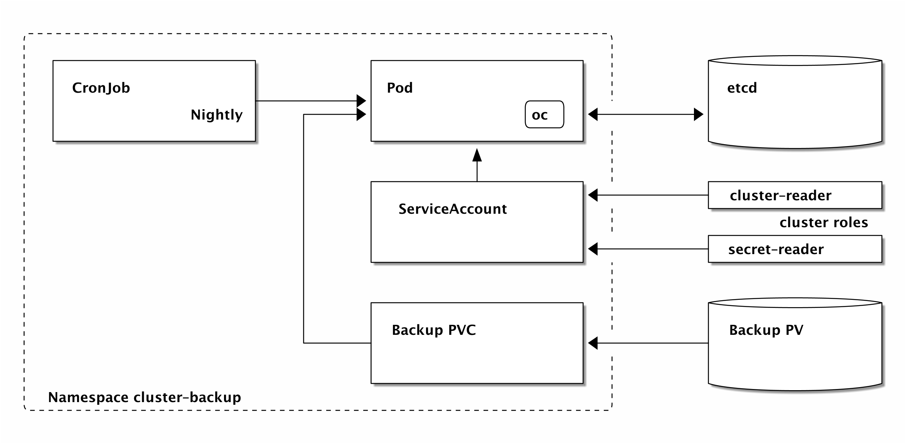
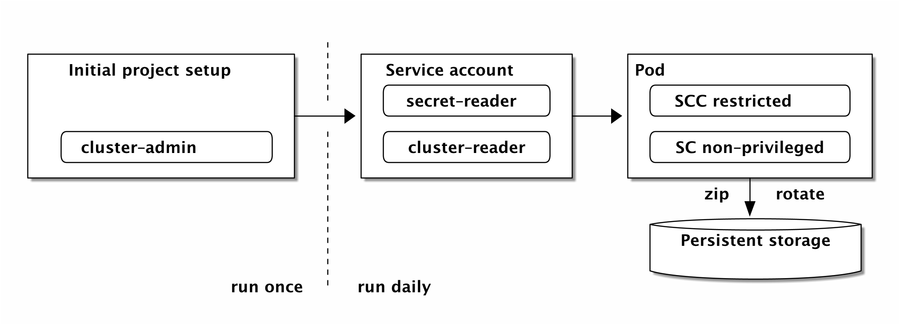

# OpenShift cluster backup



This project sets up a CronJob running the basic project backup script [project_export.sh on GitHub](https://raw.githubusercontent.com/openshift/openshift-ansible-contrib/master/reference-architecture/day2ops/scripts/project_export.sh).

Please note that no attempt is made to back up the contents of databases or mounted persistent volumes. This backup focuses on the API objects stored in `etcd`.

Admin access is required at the start (to create project and the `cluster-reader` and `secret-reader` ClusterRoleBindings for the service account), but from then on access is strictly controlled.



## Set the timer 
```
$ make
```

## On-demand backups
In addition to the CronJob running nightly backups, you can trigger a backup any time by opening a remote shell on the pod. This pod is also useful for retrieving (and restoring!) what you have backed up.

Let's start by backing up all projects in your cluster:

```
$ oc project
Using project "cluster-backup" on server "https://127.0.0.1:8443".
$ POD=`oc get po | grep openshift-backup.*Running | head -n1 | awk '{ print $1 }'`
$ oc rsh ${POD} openshift-backup
Processing 'myproject'
Exporting namespace to api-guidelines/ns.json
Exporting rolebindings to api-guidelines/rolebindings.json
Exporting serviceaccounts to api-guidelines/serviceaccounts.json
...
```

## Build your own Docker image
You can skip this step if you're happy to use the Docker Hub image that accompanies this repo (`gerald1248/openshift-backup`).

```
$ make build-docker-image
```

## Cleanup
Call `make clean` to remove the project `cluster-backup` and the rolebinding that gives the serviceaccount `openshift-backup` read-only access to all projects.

## Run the tests
These are only present as a scaffold for now, run:
```
$ make test
```
